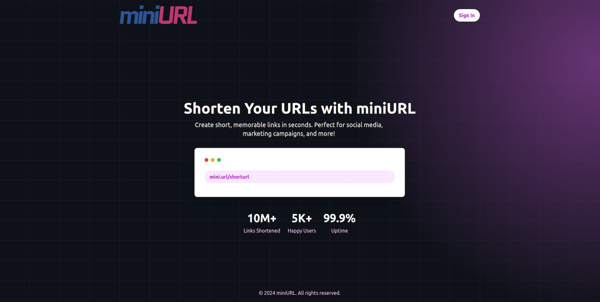

# URL Shortener with Authentication



This is a personal portfolio project that implements a URL shortener with user authentication. The project is built using **Laravel** for the backend and **Vue 3** for the frontend. Authentication is handled by **Laravel Breeze** and **Sanctum**, with tokens stored in cookies. The frontend uses **Vue Router** for navigation, **Axios** for making HTTP requests, and **Tailwind CSS** for styling.

## Features

- User authentication (register, login, logout)
- Authenticated users can shorten URLs
- Users can view their shortened URLs
- URL redirection without authentication
- Tokens are stored in cookies for enhanced security
- Responsive design using Tailwind CSS

## Tech Stack

- **Backend**: Laravel with Breeze & Sanctum
- **Frontend**: Vue 3, Vue Router, Axios, Tailwind CSS
- **Database**: MySQL
- **Authentication**: Token-based authentication (stored in cookies, no JWT)

## Installation

### Prerequisites

- PHP 8.x
- Composer
- Node.js & npm
- MySQL

### Backend Setup (Laravel)

1. Clone the repository:
   ```bash
   git clone https://github.com/your-username/url-shortener.git
   cd miniurl
   ```
2. Install services dependencies:
   ```bash
   cd services
   composer install
   ```
3. Run migrations to set up the database:
   ```bash
   php artisan migrate
   ```

### Frontend Setup (Vue)

1. php artisan migrate
   ```bash
   cd miniurl-app
   ```
2. Install npm dependencies:
   ```bash
   npm run install
   ```
3. Run the development server:
   ```bash
   npm run dev
   ```

## Usage

1. Open your browser and go to http://localhost:5173 (or whichever port you used) to access the application.
2. Register a new account or log in if you already have one.
3. Use the provided interface to shorten URLs and manage your links.
